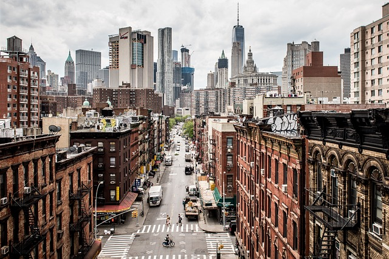
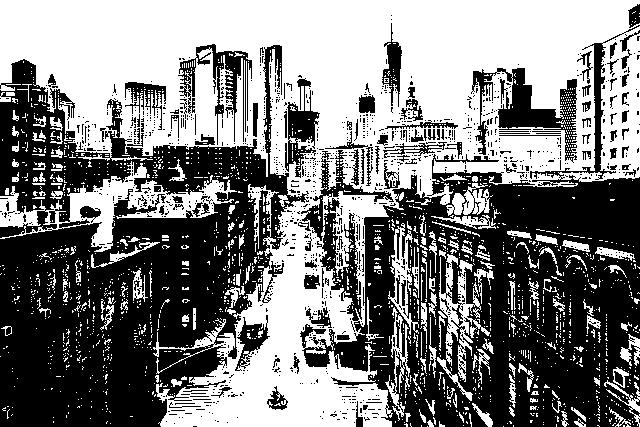

# max-contrast

Library which replicates the Paint.net contrast & brightness functionality in Python, allowing you to increase the contrast of an image until it turns B&W. 

# Usage
```python
from max_contrast import contrast_image

# contrast_image(image_path, brightness, contrast, save_path=False, show=False)
contrast_image("./example.png", 0, 100, "./example-contrasted.png")
```

# Example (Contrasting 100, Brightness 0)

